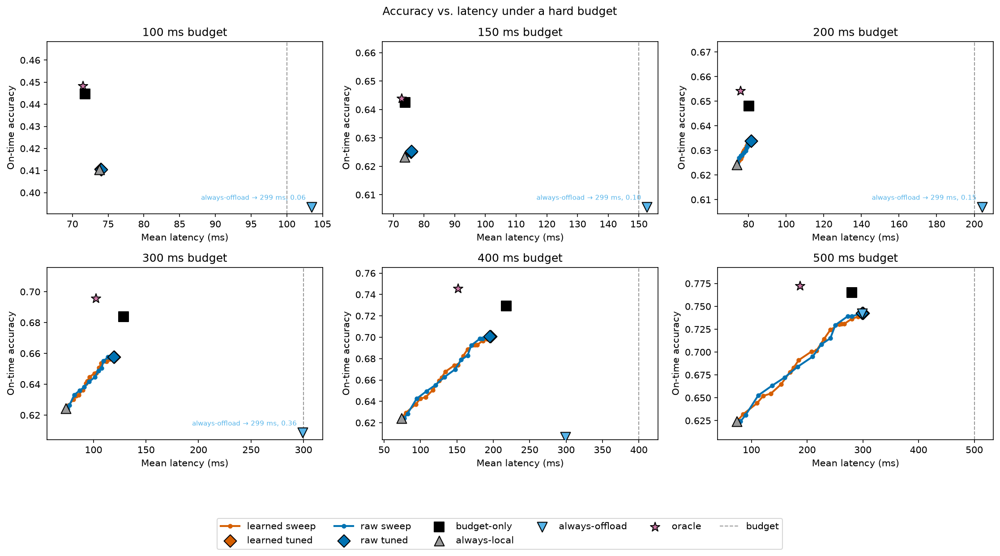

# Router findings — direct classifier / non-linear classifier / utility regression

Three router designs were trained and evaluated on real `simulation_results` data
(100,000 rows / 500 unique photos across the 4 presets, frame-level train/test
split so no photo's rows cross the split): a scaled logistic regression on
label, a `HistGradientBoostingClassifier` on label, and a linear regression per
utility target (local/offload latency + accuracy) combined into a predicted
utility per path. All three trained and evaluated on the same 5 input features:
`network_bandwidth_mbps`, `network_latency_ms`, `network_packet_loss_pct`,
`device_load_pct`, `scene_complexity`.

## Result: none of them beat "always offload"

| Approach | Avg utility (held-out) |
|---|---|
| Always offload (static baseline) | 0.6812 |
| Logistic classifier | 0.6574 (comparable, no clear win) |
| HistGB non-linear classifier | did not outperform logistic |
| Linear utility regression | 0.6811 — a statistical tie with always-offload |

The utility-regression router picked LOCAL on only 228 of 20,000 held-out rows
(1.1%), all inside the `degraded-network-idle-device` preset, and even there its
average utility (0.662952) was marginally *below* always-offload's (0.663559) —
135 wins vs. 93 losses that roughly cancel out.

## The task itself has real headroom — the models just aren't capturing it

Computed an oracle ceiling: per row, whichever of local/offload has the higher
*real* (measured, not predicted) utility. Result on the same held-out set:

- Always-offload avg utility: 0.6812
- **Oracle avg utility: 0.7208** — headroom of 0.0396 (~5.8% relative)
- Router avg utility: 0.6811 — captured **-0.4%** of that headroom (noise)
- Oracle picks LOCAL on 46.5% of rows — not a rare edge case

Critically, the oracle prefers LOCAL a lot even in `baseline` (2213/5000) and
`device-stress` (1986/5000) — presets where the router never once picked LOCAL,
and where fast network + idle device would naively suggest offload should
dominate. So the correct decision is not mostly a function of macro network/
device conditions, which is the only kind of signal these 5 features give a
per-condition-vector router.

## Root cause: `scene_complexity` carries no signal about the margin

Pearson correlation between each feature and the real per-row margin
(`local_utility - offload_utility`), computed on the full dataset (not just the
held-out split — this is a feature diagnostic, not a trained model, so there's
no leakage concern):

| Feature | Correlation with margin |
|---|---|
| `network_latency_ms` | 0.172 |
| `network_packet_loss_pct` | 0.108 |
| `network_bandwidth_mbps` | -0.105 |
| `device_load_pct` | -0.091 |
| `scene_complexity` | **0.002** |

The network/device features carry weak-but-real signal (consistent with the
router occasionally firing under bad-network/idle-device conditions). But
`scene_complexity` — the only *frame-specific* feature available — is
statistically uncorrelated with which path wins for a given frame.

Since real per-frame accuracy is a fixed property of (model, frame) that
doesn't depend on network/device conditions (by this project's own design —
see `CLAUDE.md`'s reference to the research notes), and network/device
conditions are shared across every frame sampled under one condition vector,
`scene_complexity` was the router's only lever for frame-specific decisions.
It's dead weight. This is why oracle disagrees with always-offload across
*every* preset (not just the stressed ones) while the router only ever fires
in one: the router literally cannot see the thing that actually predicts a
frame's outcome.

## Conclusion

This is a feature-starvation problem, not a model-capacity or wrong-objective
problem — all three model designs (linear, non-linear, and a different
training objective) hit the same wall because they share the same 5 inputs.
No amount of retraining on these features would be expected to close the gap
to the oracle ceiling. The real headroom (~5.8% relative utility) is genuine
and worth pursuing, but the next step is better frame-level features, not
another model architecture on the same ones.

## Feature-router experiment (spec 01 image/confidence features)

`python -m router.feature_experiment` tests whether the frame-level features
computed in spec 01 — five image statistics plus scene complexity, and six
local-model confidence/detection statistics — close the headroom the section
above identified. Two runs on the real database produced byte-identical
output.

This experiment differs from the three baseline routers above in shape, not
just inputs, so the numbers aren't directly comparable row-for-row:

- **Two-stage, to use all 5,000 frames without leaking the 500 simulated
  photos.** Stage 1 is trained only on the ~4,500 frames that never appear in
  `simulation_results`, and predicts a per-frame accuracy gap and a
  local-good-enough probability from frame features alone. Stage 2 is a
  classifier trained on the existing frame-level split's 400 train photos,
  combining stage 1's two outputs with the network/device features; it is
  evaluated on the split's 100 held-out test photos.
- **Eight routers**, one per design × model family × stage-2 objective:
  `decide_first_linear`, `decide_first_gbt`, `cascade_linear`, `cascade_gbt`
  (stage 2 is an unweighted 0/1 classifier on the stored/cascade label — the
  original four), plus the same four design/family combinations again with
  `_costaware` appended (stage 2 instead regresses the per-row utility
  margin, `local_utility − alternative_utility`, and picks LOCAL/ACCEPT where
  the predicted margin is positive — discussed after the results table
  below). Decide-first picks LOCAL/OFFLOAD before any inference; the cascade always
  runs local first and decides whether to also escalate to offload, charged
  local+offload latency when it does.
- Evaluation is on the held-out photos' simulated rows only (100 photos, not
  the earlier baselines' 500), with a bootstrap CI over those held-out photos.

### Feature diagnostics (Spearman rho vs. offload − local gap, all 5,000 frames)

| feature | spearman_rho | p_value |
|---|---|---|
| mean_confidence | -0.223945 | 7.233081e-58 |
| min_confidence | -0.195415 | 3.182400e-44 |
| min_box_area | -0.146368 | 2.395080e-25 |
| detection_count | 0.138978 | 5.466211e-23 |
| max_confidence | -0.125996 | 3.797722e-19 |
| mean_box_area | -0.114944 | 3.557516e-16 |
| entropy | 0.067329 | 1.887492e-06 |
| contrast | 0.057111 | 5.330019e-05 |
| sharpness | 0.042509 | 2.642907e-03 |
| scene_complexity | 0.038575 | 6.372150e-03 |
| brightness | -0.034129 | 1.580647e-02 |
| colorfulness | -0.008962 | 5.263734e-01 |

The six confidence features (need a local inference pass to compute) carry
the strongest signal — `mean_confidence` and `min_confidence` lead at
|rho| ≈ 0.20–0.22, both p ≪ 0.001. The five image statistics that don't
require running any model are much weaker: `scene_complexity` is significant
(rho = 0.038575, p = 0.0064) but tiny, and `colorfulness` is not
distinguishable from zero (p = 0.53). This matches the standalone quick check
that motivated this experiment (image-only AUC ≈ 0.56, confidence-feature AUC
≈ 0.71): the frame-level signal exists mostly in what the local model itself
reports about a frame, not in the frame's raw image statistics.

### Router results (100 held-out test photos)

| router | avg util | local | offload | oracle | headroom | 95% CI | useful | casc ceiling |
|---|---|---|---|---|---|---|---|---|
| decide_first_linear | 0.6575 | 0.6022 | 0.6812 | 0.7208 | -59.95% | [-0.0471, -0.0024] | False | - |
| decide_first_gbt | 0.6555 | 0.6022 | 0.6812 | 0.7208 | -64.94% | [-0.0563, -0.0003] | False | - |
| cascade_linear | 0.6289 | 0.6022 | 0.6812 | 0.7208 | -132.12% | [-0.0898, -0.0169] | False | 0.7091 |
| cascade_gbt | 0.6330 | 0.6022 | 0.6812 | 0.7208 | -121.93% | [-0.0832, -0.0169] | False | 0.7091 |
| decide_first_linear_costaware | 0.6810 | 0.6022 | 0.6812 | 0.7208 | -0.41% | [-0.0020, 0.0014] | False | - |
| decide_first_gbt_costaware | 0.6672 | 0.6022 | 0.6812 | 0.7208 | -35.30% | [-0.0334, 0.0017] | False | - |
| cascade_linear_costaware | 0.6611 | 0.6022 | 0.6812 | 0.7208 | -50.89% | [-0.0302, -0.0104] | False | 0.7091 |
| cascade_gbt_costaware | 0.6549 | 0.6022 | 0.6812 | 0.7208 | -66.42% | [-0.0469, -0.0046] | False | 0.7091 |

`casc ceiling` (cascade rows only, added for review finding S2): the cascade
design's own ceiling, `max(local_utility, escalated_utility)` per row
(`router.evaluation.cascade_ceiling_utility`), averaged over the held-out
rows — identical across all four cascade routers since it depends only on
the held-out rows, not on any router's picks.

Held-out split: 400 train photos / 100 test photos (`router.dataset
.frame_level_split`, seed 42). Two runs of `python -m router.feature_experiment`
on the real database produced byte-identical output for all eight rows,
including the `casc ceiling` column and the always-escalate figure below.

**The classifier objective's negative result is mostly a cost-blind
threshold, not feature starvation or overfitting — except for GBT, which
does overfit.** Stage 2's classifier is fit on 0/1 labels and picks
LOCAL/ACCEPT wherever its predicted probability exceeds 0.5. But the two
kinds of mistake it can make cost very different amounts: on the train
photos, a correct LOCAL pick gains 0.088 utility on average, while a wrong
LOCAL pick loses 0.220 — so the break-even predicted probability is about
0.71, not 0.5. A classifier thresholded at 0.5 picks LOCAL far more often
than that asymmetry justifies. `decide_first_linear`'s 0.6575 is not a
*stronger*, more negative result than the three baseline routers above — it
reproduces `router.baseline`'s logistic classifier almost exactly (0.6574,
corrected above), the same classifier-loss artifact under a different
feature set.

**Cost-aware stage 2 (margin regression) changes the linear verdict.**
Retraining stage 2 as a regressor on the per-row utility margin
(`local_utility − alternative_utility`), picking LOCAL/ACCEPT wherever the
predicted margin is positive, raises `decide_first_linear` to
`decide_first_linear_costaware`'s 0.6810 with 95% CI [-0.0020, 0.0014] — a
statistical tie with always-offload, not a loss. `cascade_linear_costaware`
also improves, to 0.6611, but its CI ([-0.0302, -0.0104]) stays entirely
below zero: cost-awareness helps the cascade design without clearing the
bar. Both GBT cost-aware variants improve over their classifier counterparts
too (`decide_first_gbt_costaware` 0.6672, `cascade_gbt_costaware` 0.6549)
but remain significantly negative — `decide_first_gbt_costaware`'s CI
([-0.0334, 0.0017]) now brushes zero at its upper end, but still spans it
rather than clearing it, so it is not useful either.

**The overfitting claim only holds for the GBT variants, and its cause was
`predicted_gap` acting as a photo ID — fixed by constraining stage 2's leaf
size.** Linear stage 2's train/test accuracy is close (0.570/0.560 for
decide-first, 0.644/0.604 for cascade) — not overfitting, so the linear
family needed no change. GBT stage 2 originally showed a large train/test
gap — 0.982/0.555 (decide-first) and 0.992/0.526 (cascade) — because
`predicted_gap` (stage 1's own regression output, one of stage 2's five
inputs) takes ~400 distinct values across the 400 train photos, essentially
one per photo: an unconstrained `HistGradientBoostingClassifier`/
`HistGradientBoostingRegressor` can split on that near-unique value per
training row instead of learning a generalizable relationship, memorizing
which photo each row belongs to rather than the actual gap.

**Fix (S1):** every GBT stage-2 model (the classifier and the cost-aware
regressor) now fits with `min_samples_leaf` set to `STAGE2_MIN_LEAF_PHOTOS`
(20) photos' worth of rows, computed from the training data itself (`len(df_train)
/ df_train["frame_id"].nunique()` rows per photo, × 20) rather than a
hard-coded row count — 4,000 rows on this dataset's 200 rows/photo. A leaf
that must hold 20 photos' rows can never isolate one photo's `predicted_gap`
value, so the near-unique-per-photo split that caused the memorization is no
longer available. The linear family is untouched (`training/router/two_stage.py`).
After the fix, GBT stage 2's train/test accuracy is 0.8157/0.5847
(decide-first) and 0.8394/0.5594 (cascade) — the train/test gap roughly
halves (0.427 → 0.231 decide-first, 0.465 → 0.280 cascade) instead of
closing entirely, because a 4,000-row leaf can still span ~20 neighboring
photos and pick up some real signal from `predicted_gap`'s ordering (which
does correlate with the true label, since stage 1 is trained to predict the
gap) rather than memorizing any single photo. The router utility numbers in
the table above are the post-fix numbers; no GBT variant's verdict changes
(all four remain `useful=False`), but every GBT row's CI narrows and shifts
toward zero.

The `oracle` column above is the same unconstrained per-row max of local and
offload utility used throughout this file (0.7208), which the spec directs
both designs to be compared against — including the cascade rows, so their
`headroom` percentages are measured against 0.7208, not against the lower
number below. The cascade design's own ceiling — the best any
ACCEPT/ESCALATE assignment could do, `max(local_utility, escalated_utility)`
per row — is **0.7091** (`casc ceiling` column above). That is below the
0.7208 oracle but *above* always-offload's 0.6812: a cascade router has real
headroom of about **0.028** over always-offload, which the oracle-relative
`headroom` percentages in the table can't show. For reference, always-escalate
(every row ESCALATEs) averages **0.6591** — below always-offload, not above
it. The reason the cascade ceiling sits below the oracle is simply that
ESCALATE is charged both the local pass's and the offload pass's latency,
while the oracle's OFFLOAD alternative is only ever charged the offload
pass's: escalating adds the local pass's latency (0.6812 − 0.6591 = 0.0221
utility, ≈74 ms at `DEFAULT_LAMBDA = 0.3`) to every row, which a cascade
router can never avoid paying once it decides to escalate.

### Feature compute cost (from spec 01)

Image features: 5.3 ms/frame. Confidence features: 20.5 ms/frame, almost all
of it the YOLOv8n inference pass itself, not the statistics computed from its
output. Both measured on desktop CPU. Neither is free, and the confidence
features — the ones actually carrying signal — cost roughly 4x the image
features specifically because they require running the local model, which a
decide-first router is trying to avoid running at all.

### Recommendation

Do not resume the parked phone/server work
(`features/server-served-benchmark/`) yet. Of the eight routers this
experiment built — spanning both a decide-first and a cascade design, a
linear and a gradient-boosted model family, and both a classifier and a
cost-aware stage-2 objective — `decide_first_linear_costaware` and
`decide_first_gbt_costaware` reach a statistical tie with always-offload
(their CIs straddle zero); the other six, including every cascade variant,
remain worse with 95% confidence. A tie is not a router worth deploying
either. The oracle headroom above always-offload is real
(~0.0396 utility, matching the earlier section), but nothing built here
shows a way to capture it reliably. Building phone-side feature extraction
and a server-side serving path only pays off once there is a router that
beats always-offload, and none of these eight do.

If the router idea is revisited before touching phone/server infrastructure,
cost-aware stage 2 (margin regression, not more train photos) was the first
candidate next step, and this experiment already tried it — see the
`_costaware` rows above. It closed the gap for `decide_first_linear` (a tie)
and, once the GBT memorization fix (S1) landed, also brought
`decide_first_gbt_costaware`'s CI to straddle zero (a tie, not a win) — but
not for the cascade design under either family. One next step remains
untried: possibly dropping the image statistics entirely in favor of the
confidence features alone, since the diagnostics above show almost all of
the frame-level signal comes from running the local model, not from its raw
image statistics — which also undercuts the decide-first design's premise
of avoiding that inference pass.

If a future rerun does clear the usefulness bar — particularly for the
cascade, whose local-first design is the one that would actually save
offload traffic — the concrete next measurement for
`features/server-served-benchmark/` is real on-phone latency for the
local-first path. Every number in this experiment (like the earlier
baselines) uses the stored desktop latencies; the cascade's premise is
skipping the network round trip on accepted frames, and that premise's value
depends on the local model's actual on-phone inference time, which nothing
in this repo has measured yet.

**Superseded by spec 03.** `features/router-frame-features/03-latency-budget-router`
reframes the router's objective away from the soft weighted-utility score
this whole file uses (under which "always offload" is nearly unbeatable
because latency is cheap) toward a hard per-request latency budget with
accuracy maximized inside it. That reframing supersedes the recommendation
above, not just its next-steps list — the "does any router beat
always-offload on this utility" question this file answers stops being the
relevant question once the objective changes.

## Latency-budget experiment (spec 03)

### Why the framing changed

Under the soft utility above (`accuracy − 0.3 × latency in seconds`),
nothing beat always-offload: the best cost-aware routers only reached a
statistical tie. Latency is nearly free under that weighting — offload's
~15-point accuracy advantage (0.7709 vs. always-local's 0.6243) outweighs
the ~0.07 utility its extra ~225 ms costs (0.225 s × the 0.3 weight), so a
router has almost nothing to gain by ever avoiding it. Published systems that route between local and remote inference don't
use a soft blended score; they either treat latency as a hard constraint
(DeepDecision) or cascade on confidence and report a trade-off curve
(DDNN, Big/LITTLE) rather than a single weighted number. This experiment
reframes the router that way: each request has a hard latency budget,
routing must maximize accuracy inside it, and results are reported as
accuracy-vs-latency curves per budget instead of one utility figure.

`python -m router.budget_experiment` ran twice on the real database; both
runs produced byte-identical stdout and byte-identical PNGs. Re-running
`python -m router.feature_experiment` afterward reproduced every number in
the "Feature-router experiment" section above exactly (the Spearman table
and all eight router rows, including the `casc ceiling` column), confirming
the generic-bootstrap refactor in `router/evaluation.py` changed nothing
about spec 02's results.

Held-out split: 400 train photos / 100 test photos (`router.dataset
.frame_level_split`, seed 42) — the same split spec 02 uses.

### Per-budget results

Each table reports mean accuracy, on-time accuracy (a result that arrives
after the budget counts as 0), mean latency and the share of requests that
missed the budget, for every policy on the 100 held-out test photos. The
cascade rows use each score's threshold tuned on the training photos alone
(τ, highest on-time accuracy on train).

**100 ms budget** — raw τ = 0.65, learned τ = 0.45

| policy | mean acc | on-time acc | mean latency (ms) | over-budget % |
|---|---|---|---|---|
| always-local | 0.6243 | 0.4104 | 73.77 | 34.36% |
| always-offload | 0.7709 | 0.0602 | 299.05 | 92.21% |
| budget-only | 0.6360 | 0.4447 | 71.76 | 30.56% |
| cascade-raw | 0.6248 | 0.4105 | 74.01 | 34.41% |
| cascade-learned | 0.6248 | 0.4106 | 73.97 | 34.39% |
| oracle | 0.6359 | 0.4484 | 71.44 | 30.11% |

vs budget-only 95% CI: raw [-0.0374, -0.0310], learned [-0.0374, -0.0310] —
useful=False for both. vs always-local 95% CI: raw [-0.0002, 0.0004],
learned [-0.0001, 0.0004] — straddles zero, a statistical tie.

**150 ms budget** — raw τ = 0.85, learned τ = 0.70

| policy | mean acc | on-time acc | mean latency (ms) | over-budget % |
|---|---|---|---|---|
| always-local | 0.6243 | 0.6233 | 73.77 | 0.15% |
| always-offload | 0.7709 | 0.1022 | 299.05 | 86.72% |
| budget-only | 0.6434 | 0.6425 | 73.82 | 0.13% |
| cascade-raw | 0.6283 | 0.6253 | 75.91 | 0.45% |
| cascade-learned | 0.6280 | 0.6251 | 75.74 | 0.43% |
| oracle | 0.6447 | 0.6439 | 72.63 | 0.12% |

vs budget-only 95% CI: raw [-0.0215, -0.0128], learned [-0.0220, -0.0129] —
useful=False for both. vs always-local 95% CI: raw [0.0008, 0.0033],
learned [0.0007, 0.0029] — entirely above zero.

**200 ms budget** — raw τ = 0.95, learned τ = 1.00

| policy | mean acc | on-time acc | mean latency (ms) | over-budget % |
|---|---|---|---|---|
| always-local | 0.6243 | 0.6243 | 73.77 | 0.00% |
| always-offload | 0.7709 | 0.1514 | 299.05 | 80.42% |
| budget-only | 0.6536 | 0.6481 | 80.10 | 0.77% |
| cascade-raw | 0.6375 | 0.6338 | 81.39 | 0.48% |
| cascade-learned | 0.6375 | 0.6338 | 81.47 | 0.48% |
| oracle | 0.6543 | 0.6543 | 75.72 | 0.00% |

vs budget-only 95% CI: raw [-0.0190, -0.0098], learned [-0.0190, -0.0098] —
useful=False for both. vs always-local 95% CI: raw [0.0059, 0.0133],
learned [0.0059, 0.0133] — entirely above zero.

**300 ms budget** — raw τ = 0.95, learned τ = 1.00

| policy | mean acc | on-time acc | mean latency (ms) | over-budget % |
|---|---|---|---|---|
| always-local | 0.6243 | 0.6243 | 73.77 | 0.00% |
| always-offload | 0.7709 | 0.3600 | 299.05 | 53.31% |
| budget-only | 0.6932 | 0.6839 | 128.66 | 1.24% |
| cascade-raw | 0.6658 | 0.6578 | 119.03 | 1.04% |
| cascade-learned | 0.6658 | 0.6578 | 119.47 | 1.04% |
| oracle | 0.6958 | 0.6958 | 102.21 | 0.00% |

vs budget-only 95% CI: raw [-0.0340, -0.0186], learned [-0.0340, -0.0186] —
useful=False for both. vs always-local 95% CI: raw [0.0217, 0.0453],
learned [0.0217, 0.0453] — entirely above zero.

**400 ms budget** — raw τ = 0.95, learned τ = 1.00

| policy | mean acc | on-time acc | mean latency (ms) | over-budget % |
|---|---|---|---|---|
| always-local | 0.6243 | 0.6243 | 73.77 | 0.00% |
| always-offload | 0.7709 | 0.6064 | 299.05 | 21.34% |
| budget-only | 0.7401 | 0.7294 | 218.00 | 1.40% |
| cascade-raw | 0.7064 | 0.7010 | 195.37 | 0.73% |
| cascade-learned | 0.7064 | 0.7010 | 196.57 | 0.73% |
| oracle | 0.7454 | 0.7454 | 151.43 | 0.00% |

vs budget-only 95% CI: raw [-0.0379, -0.0191], learned [-0.0380, -0.0192] —
useful=False for both. vs always-local 95% CI: raw [0.0543, 0.1001],
learned [0.0542, 0.1001] — entirely above zero.

**500 ms budget** — raw τ = 0.95, learned τ = 1.00

| policy | mean acc | on-time acc | mean latency (ms) | over-budget % |
|---|---|---|---|---|
| always-local | 0.6243 | 0.6243 | 73.77 | 0.00% |
| always-offload | 0.7709 | 0.7423 | 299.05 | 3.71% |
| budget-only | 0.7651 | 0.7651 | 280.43 | 0.00% |
| cascade-raw | 0.7472 | 0.7427 | 298.46 | 0.58% |
| cascade-learned | 0.7472 | 0.7427 | 300.73 | 0.58% |
| oracle | 0.7727 | 0.7727 | 186.96 | 0.00% |

vs budget-only 95% CI: raw [-0.0275, -0.0173], learned [-0.0275, -0.0173] —
useful=False for both. vs always-local 95% CI: raw [0.0848, 0.1534],
learned [0.0848, 0.1534] — entirely above zero.

### The headline result: condition-based budget-only nearly matches the oracle

The main positive result in this experiment is not the cascade — it's the
plain **budget-only** policy (DeepDecision-style: offload only if the
predicted offload latency fits the budget, decided up front from network
and device conditions, no local inference required to decide). At every
budget its on-time accuracy lands within about 0.4-1.6 points of the
within-budget oracle:

| budget | budget-only on-time | oracle on-time | gap |
|---|---|---|---|
| 100 ms | 0.4447 | 0.4484 | 0.0037 |
| 150 ms | 0.6425 | 0.6439 | 0.0014 |
| 200 ms | 0.6481 | 0.6543 | 0.0062 |
| 300 ms | 0.6839 | 0.6958 | 0.0119 |
| 400 ms | 0.7294 | 0.7454 | 0.0160 |
| 500 ms | 0.7651 | 0.7727 | 0.0076 |

The offload-latency predictor driving budget-only's decisions is itself
highly accurate: on the held-out test rows it reaches R2 = 0.9951 and
MAE = 6.60 ms (train rows: R2 = 0.9952, MAE = 6.47 ms — tuning on train
rows adds no meaningful optimism, since train and test accuracy are
essentially the same).

And it beats both static baselines on on-time accuracy at every budget,
sometimes by a wide margin:

| budget | budget-only on-time | always-local on-time | always-offload on-time |
|---|---|---|---|
| 100 ms | 0.4447 | 0.4104 | 0.0602 |
| 150 ms | 0.6425 | 0.6233 | 0.1022 |
| 200 ms | 0.6481 | 0.6243 | 0.1514 |
| 300 ms | 0.6839 | 0.6243 | 0.3600 |
| 400 ms | 0.7294 | 0.6243 | 0.6064 |
| 500 ms | 0.7651 | 0.6243 | 0.7423 |

At 300 ms budget-only's 0.6839 clears always-local's 0.6243 and
always-offload's 0.3600; at 400 ms it clears 0.6243 and 0.6064 by more
than 10 points each — always-offload loses ground there specifically
because 21.34% of its unconditional offloads arrive after 400 ms, while
budget-only avoids all but 1.40% of those misses by declining to offload
when its own latency prediction says it won't fit. At the loosest budget
(500 ms) budget-only's mean accuracy (0.7651) sits just under
always-offload's (0.7709), but its on-time accuracy is *higher* (0.7651
vs 0.7423) for the same reason: it pays for 0% over-budget misses where
always-offload pays for 3.71%.

The same paired photo-level bootstrap used for the cascade comparisons
(`bootstrap_mean_difference`, seed 42) also covers this gap directly. Every
interval lies entirely above zero:

| budget | vs always-local 95% CI | vs always-offload 95% CI |
|---|---|---|
| 100 ms | [0.0311, 0.0376] | [0.3443, 0.4242] |
| 150 ms | [0.0139, 0.0245] | [0.4834, 0.5946] |
| 200 ms | [0.0159, 0.0320] | [0.4447, 0.5465] |
| 300 ms | [0.0410, 0.0791] | [0.2902, 0.3571] |
| 400 ms | [0.0732, 0.1376] | [0.1097, 0.1357] |
| 500 ms | [0.1024, 0.1809] | [0.0203, 0.0253] |

The one hard floor even budget-only and the oracle can't clear is 100 ms:
local latency alone exceeds the budget for roughly a third of frames
(always-local's own over-budget share is 34.36%), so no assignment of any
kind reaches much above 0.45 on-time accuracy there — the oracle itself
only reaches 0.4484.

### The cascade verdict: not useful at any budget

The rule: the tuned cascade counts as useful at a budget only if its
on-time-accuracy interval against budget-only lies entirely above zero.
By that rule, **the cascade is not useful at any of the six budgets, for
either score** — at every single budget, both scores' 95% CI against
budget-only has a strictly negative upper bound (worst: [-0.0380, -0.0192]
at 400 ms; best: [-0.0220, -0.0129] at 150 ms). The tuned cascade is
significantly *worse* than the simpler budget-only policy everywhere it
was tested, though it does beat always-local at every budget from 150 ms
up (CI entirely above zero) and ties it at 100 ms (CI straddles zero).

The mechanism is structural, not a tuning or modeling failure, and the
held-out data shows there is almost nothing for either score to
discriminate: offload accuracy is at least local accuracy on 98.00% of
held-out test rows, and local is strictly better on only 2.00% of them.
The best any cascade could gain over always-offloading is confined to
that 2%, so the comparison against budget-only is decided mainly by the
local-first latency cost, not by how well a score ranks frames:

- **At 200-500 ms, the tuned thresholds are 0.95 or 1.00, and almost no
  row clears them.** Only 1.00% of test rows have a raw score at or above
  its tuned threshold at 200-500 ms, and 0.00% have a learned score at or
  above its tuned threshold of 1.00 (it escalates every row). Given that
  offload wins on 98.00% of rows, this is the tuning search finding the
  policy the data actually rewards — "run local, then offload whenever it
  fits" — not evidence that confidence fails to separate "local is good
  enough" frames from the rest. Since an escalated request is charged
  local *plus* offload latency while budget-only's offloads pay only
  offload latency, the cascade pays for the local pass on nearly every
  request without reliably earning it back in accuracy — at 300 ms this
  shows up as cascade-raw's mean latency (119.03 ms) actually being
  *lower* than budget-only's (128.66 ms) because it's forced to escalate
  less often to stay under budget, trading accuracy for it (0.6578 vs
  0.6839 on-time); at 400-500 ms the pattern flips and cascade's mean
  latency tracks close to or above budget-only's while its accuracy still
  trails, because the local pass eats into the same budget budget-only can
  spend entirely on the offload path.
- **At 100-150 ms, the tuned thresholds drop instead (0.65/0.45, keeping
  40.00%/51.00% of rows local, and 0.85/0.70, keeping 12.00%/19.00% of
  rows local)** — not because confidence becomes more selective, but
  because local-then-offload almost never fits inside so tight a budget
  once the local pass is paid for, so the search finds that keeping local
  more often is the least-bad option. The result is the cascade collapsing
  toward always-local (statistically tied with it at 100 ms) rather than
  toward budget-only.
- **Either way, the tuned threshold can't recover the gap** — it only
  trades which side of it the cascade loses on. This reproduces, under a
  completely different objective, the same structural finding spec 02's
  cascade-ceiling analysis made: "escalating adds the local pass's latency
  ... which a cascade router can never avoid paying once it decides to
  escalate."
- **Raw and learned scores tie because both cascades collapse to the same
  policy, not because the two scores rank frames equally well.** At every
  budget the two scores' tuned metrics agree to at least 3 decimal places
  in accuracy (e.g. 0.6248 vs 0.6248 at 100 ms mean accuracy; identical to
  4 decimals at 200-500 ms), and at 200-500 ms both tuned cascades keep
  essentially the same near-empty share of rows local (1.00% for raw,
  0.00% for learned) despite the learned score using six confidence
  features against the raw score's one. With almost nothing separable left
  for either score to find, both searches land on "run local, then offload
  whenever it fits" regardless of how the underlying score ranks frames —
  the tie says nothing about the two scores' relative ranking quality, and
  a setting with more separable rows would be needed to test that.
- The oracle's headroom above the cascade (~0.03-0.04 on-time accuracy
  throughout) is consistently larger than its headroom above budget-only
  (0.0014-0.0160, per the table above) — confirming budget-only, not the
  cascade, is the policy actually capturing most of what's available.

This verdict is scoped to the local-first cascade the spec defines, which
always pays for a local pass before it may escalate. A hybrid router that
could also offload directly, without running locally first, was not
tested here, and nothing above rules out that such a hybrid could behave
differently.

### Figure

Six panels, one per budget, each plotting on-time accuracy against mean
latency: the raw and learned threshold-sweep curves, their tuned points,
and single markers for budget-only, always-local, always-offload and the
oracle, with a dashed vertical line at the budget. Each panel's axis limits
are clipped to that panel's own points rather than shared across panels —
always-offload's mean latency stays near a network-bound ~299 ms almost
regardless of budget, and sharing one wide axis across all six panels to
fit it would otherwise collapse the other markers into a single
indistinguishable cluster in the tight 100/150/200 ms panels. When
always-offload's true (latency, accuracy) falls outside a panel's clipped
range — every budget from 100 through 300 ms, since its on-time accuracy
stays low (0.06 to 0.36) even at 300 ms where its latency is right next to
the budget — it is drawn as a marker clamped to the panel's edge and
labelled with its real value (e.g. "always-offload → 299 ms, 0.36" at
300 ms) instead of being hidden or forcing the axes wide. At 100 ms and
150 ms the sweep curves collapse to a near-single point (escalation rarely
changes the outcome at those budgets, per the mechanism above); from
200 ms up the curves spread out visibly between the always-local cluster
and the budget-only/oracle points. Always-offload only appears at its true
in-panel position from 400 ms onward, catching up to the rest of the
cluster by 500 ms.

### Related work

This experiment's design follows a line of local/remote-inference routing
work that treats latency as a real constraint rather than folding it into
a single blended score. Kang et al.'s *Neurosurgeon* (ASPLOS 2017)
partitions a network across the local/cloud boundary layer-by-layer, using
a per-layer latency/energy prediction from system conditions — the same
kind of conditions-to-latency prediction this experiment's offload-latency
model makes, just at request granularity instead of per layer. Ran, Chen,
Zhu, Liu & Chen's *DeepDecision* (INFOCOM 2018) is the direct source of
this experiment's hard-budget framing: it maximises frame rate plus
α·accuracy subject to per-frame latency, bandwidth, battery, accuracy and
frame-rate constraints, deciding local vs. remote from network conditions.
Han et al.'s *MCDNN* (MobiSys 2016) schedules approximate models under a
resource budget with device/cloud trade-offs, the same budget-constrained
framing applied to model selection rather than a single routing decision.
Park et al.'s *Big/LITTLE* (CODES+ISSS 2015) and Teerapittayanon, McDanel &
Kung's *DDNN* (ICDCS 2017) are this experiment's cascade design's direct
ancestors: Big/LITTLE runs a little model first and escalates to a big one
only when the result isn't estimated accurate, and DDNN exits locally when
normalized entropy is below a threshold, reporting accuracy against a
local-exit-rate curve — exactly the threshold-sweep curves this
experiment's figure reports, generalized here to a latency budget instead
of an exit rate. Wang et al.'s *IDK Cascades* (UAI 2018) formalizes
cascades with an explicit "I don't know" option and a cost-aware
objective, and Chen, Zaharia & Zou's *FrugalGPT* (2023) applies the same
cascade-with-a-learned-scorer idea to LLM calls — both are the direct
precedent for comparing a raw confidence score against a learned one as
this experiment's cascade threshold, though here the two scores end up
performing equivalently rather than the learned scorer buying anything
extra. Taylor et al.'s *Adaptive Deep Learning Model Selection on Embedded
Systems* (LCTES 2018) selects per-input among models using cheap image
features and kNN for ImageNet classification — the same "route from cheap
signals computed before the expensive path" idea spec 01's frame features
and this project's raw/learned confidence scores both draw on.

### Recommendation on the phone/server work (supersedes spec 02)

**Supersedes the recommendation above.** Spec 02 recommended not resuming
`features/server-served-benchmark/` because none of its eight soft-utility
routers beat always-offload. This experiment changes that: under a hard
latency budget, **the adaptive router is worth pursuing — in its
condition-based (budget-only) form.** Routing purely on predicted network
latency, decided before any inference runs, gets within 0.4-1.6 points of
the within-budget oracle and clearly beats both always-local and
always-offload on on-time accuracy at every budget tested, in simulation.
The gap to the oracle is this small largely because simulated offload
latency is nearly deterministic given the network/device conditions — the
offload-latency predictor reaches R2 = 0.9951 and MAE = 6.60 ms on
held-out rows — and because offload is at least as accurate as local on
98.00% of held-out rows (see "Held-out test rows" above). Together these
mean "offload iff it fits" is close to optimal almost by construction of
the simulator, not because the router discovered a subtle policy. Whether
real-network latency is anywhere near this predictable is exactly what
the phone/server work needs to test — it is the central risk this
simulated result carries, not a secondary check. **Resuming
`features/server-served-benchmark/` is justified** — but to validate
budget-only, not the cascade.

The policy's simulated value rests on two things only real hardware can
confirm, and the phone/server work is exactly the way to check them:

1. **Real offload latency, and how well it can be predicted from live
   network measurements.** This experiment's offload-latency model is
   fit on the simulator's analytical relationship between
   `network_bandwidth_mbps`/`network_latency_ms`/`network_packet_loss_pct`
   and `offload_latency_ms` — not a measurement of an actual request going
   over a real network from a real phone.
2. **Real local latency on the phone.** This experiment used the
   desktop-simulated `local_latency_ms` from `simulation_results` (mean
   73.77 ms across the held-out rows). Earlier in this project, on-device
   forward-pass latency was measured on an iPhone 15 Pro at roughly
   17.34 ms mean via the Core ML delegate versus roughly 106.01 ms mean on
   CPU (`feature/mobile-inference-benchmark` branch,
   `features/mobile-inference-benchmark/learnings.md`; measured on a
   Debug development build, so still to be confirmed on a Release build) —
   a real local pass
   could be either several times cheaper or noticeably more expensive than
   this experiment's simulated figure depending on which delegate the app
   ends up using.

That second point cuts both ways for the cascade, too, and is worth
re-checking rather than treating the cascade verdict above as final. The
cascade's whole disadvantage is the local-first latency tax (paying local
*plus* offload where budget-only pays offload alone); if real on-device
local latency via Core ML turns out much cheaper than the simulated
~74 ms mean, that tax shrinks, and the cascade's tighter-budget numbers
(where the tax is proportionally largest) should be re-evaluated against
real hardware numbers before being written off for good. This experiment
doesn't establish that it would change the verdict — it only used the
stored simulated values, per spec — so it isn't grounds to prefer the
cascade over budget-only yet; it's grounds to re-run this comparison once
real local and offload latencies are available.
